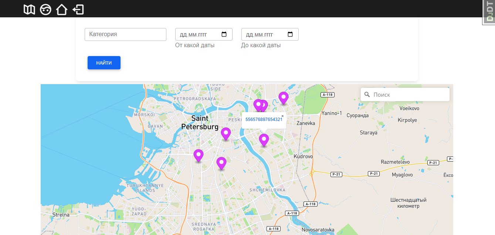
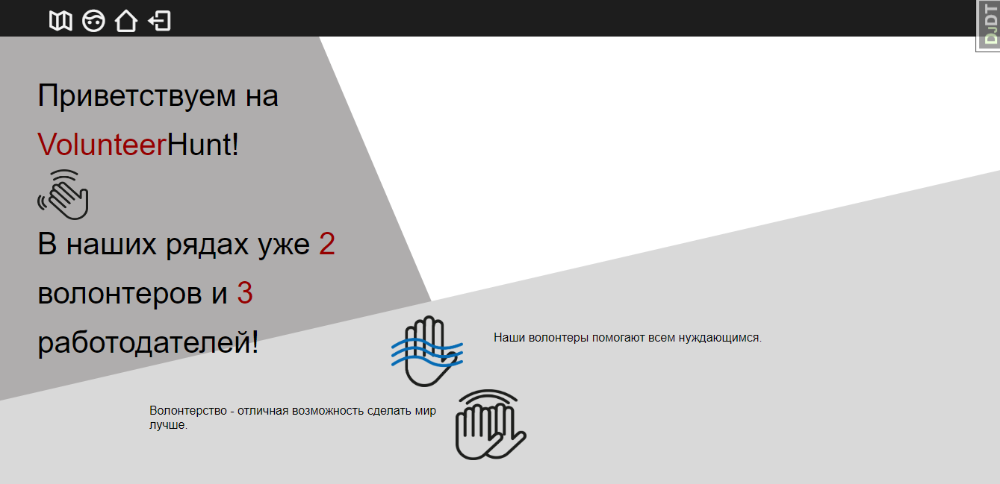
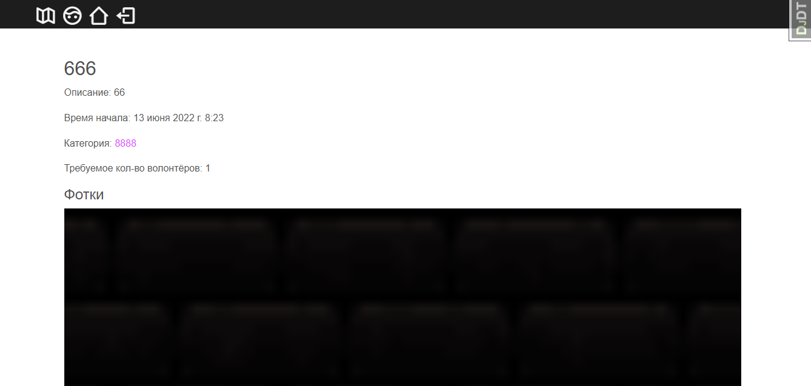
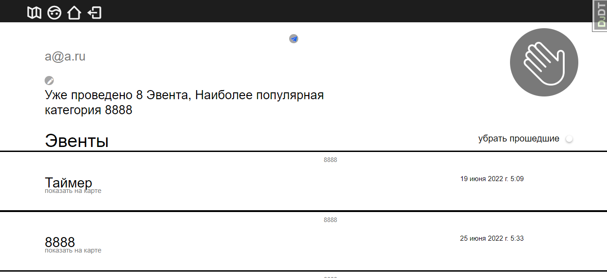
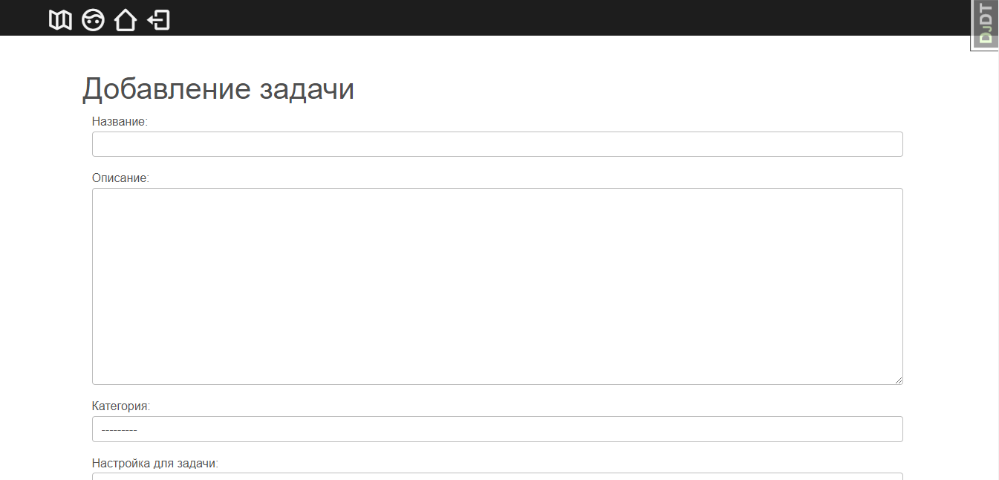
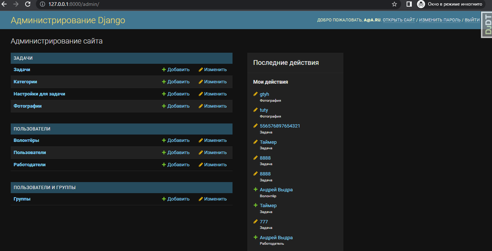
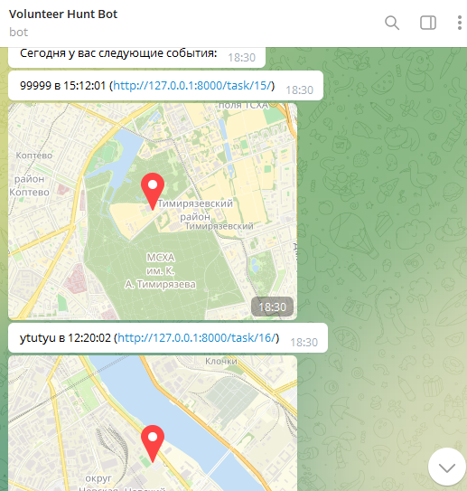

# Volunteer Hunt
## Двигатель волонтёрского движения

* [Описание](#описание)
* [Цели](#Цели)
* [Технологии](#технологии)
* [Установка](#установка)
* [Функционал](#функционал)

## Описание

**Volunteer Hunt** - web приложение, которое позволяет волонтёрам удобно находить 
задачи. Сервис разработан на хакатоне Moscow City Hack 2022

Тема проекта была рождена неслучайно: мы стали замечать, что
волонтёрское движение в России развито хуже, чем в других странах.  
Интерес к социальным проектам со стороны молодёжи только растёт, именно поэтому
мы решили создать простой информационный продукт для того, чтобы обычные люди
могли делать вклад в общество. Также не стоит забывать и об организаторах
волонтёрского движения, которым важно искать заинтересованных
людей с активной жизненной позицией.


## Цели
- _Привлечение_ обычных людей к волонтёрской деятельности
- _Создание_ простой среды для взаимодействия между волонтёрами и организаторами
- _Perfect match_ по интересам между волонтёром и работодателем
- _Формирование_ и развитие важного социального движения в России 


## Технологии
В качестве основных используемых технологий мы выбрали:

1. **Python 3.9**
2. **Django 4.0.5**
3. **Sqlite**
4. **Mapbox**
5. **Python telegram bot**

## Установка
0. Проверить наличие в папке с проектом файла **.env** со следующими 
   значениями. Для удобства проверки мы добавили .env с заготовленными заранее
   значениями (надеемся на добросовенность :) ).
   
```
SECRET_KEY=<secret_key>
MAPBOX_ACCESS_TOKEN=<mapbox_access_token>
TELEGRAM_BOT_TOKEN=<telegram_bot_token>
```
0.1. **SECRET_KEY** - любое значение, используется django для безопасности

0.2. **MAPBOX_ACCESS_TOKEN** - токен, с помощью которого работает карта. 
(Регистрация по [ссылке](https://www.mapbox.com/))

0.3. **TELEGRAM_BOT_TOKEN** - токен, который выдаётся при создании бота в 
телеграмме (рассылка уведомлений происходит в tg) **_@BotFather_**

### Установка (через Docker)
1. В папке с проектом вызвать команду для создания образа

```
docker-compose build
```

2.  Запускаем созданный образ

```
docker-compose up
```

3. Прерываем выполнение командой _Ctrl+C_ и выполняем следующую команду

```
sudo docker ps -a
```

4. Среди выведенных задач находим нашу и вызываем следующую команду

```
sudo docker exec -it <id> bash
```

5. Создаём юзера с абсолютными правами

```
python manage.py createsuperuser
```

6. Включаем бота для рассылки уведомлений

```
python manage.py bot
```

Приятного использования!

### Установка (запуск вручную)

1. В папке с проектом создаём venv и активируем его

```
py -m venv venv
.\venv\Scripts\activate
```

2. Возвращаемся в папку с проектом и устанавливаем зависимости 

```
pip install -r requirements.txt
```
   
3. Принимаем миграции для базы данных
```
py manage.py migrate
```
   
4. Создаём суперюзера и следуем инструкциям в консоли
```
py manage.py createsuperuser
```

5. Запускаем сервер и наслаждаемся :)
```
py manage.py runserver
```

6. В отдельной консоли запускаем следующую команду
```
py manage.py bot
```

## Функционал
Все ссылки на основные функции находятся в навигации.

Карта


Главная страница


Страница с задачей (переход на неё осуществляется по клику на карте
по метке и соответствующей ссылке в ней). Её отображение зависит от роли
пользователя (у работодателя есть кнопки удалить и изменить задачу, 
а у волонтёра записаться и отписаться от задачи), от того была ли завершена
(прошло ли время начала задачи). На неактивные задачи нельзя записаться, их
нельзя менять и взаимодействовать с ними тоже нельзя
(они остаются в системе для истории).


В профиле юзера показаны все задачи, которые связаны с ним (для работодателя
созданные им задачи, а для волонтёра задачи на которые он записался). Ссылка на
телеграм бота, в котором можно привязать рассылку уведомления по "задачам".


Создание задач доступно только для работодателя


Создание категорий и настроек поиска доступно только для администратора в
админ панели!


Telegram бот
